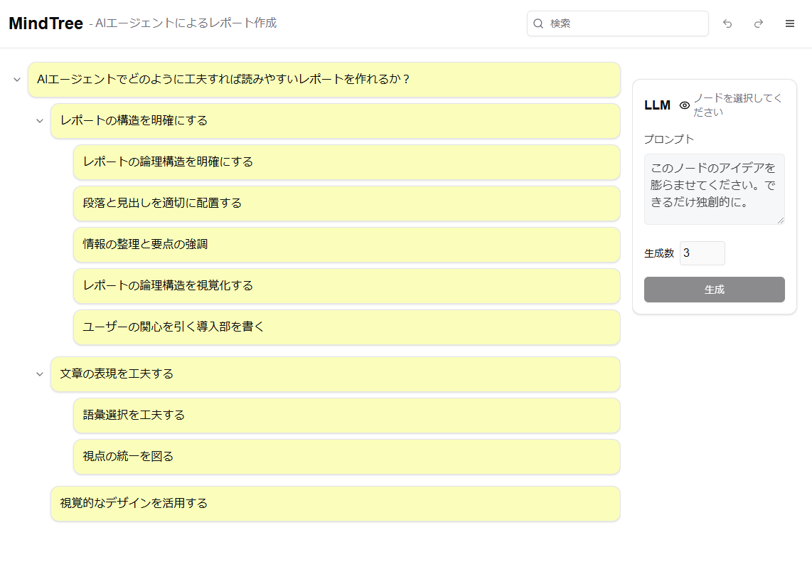

# MindTree（マインドツリー）

MindTreeは、ブラウザ上で動作するマインドマップ作成支援Webアプリケーションです。マインドマップをインデントされた箇条書きツリー形式で表現することで、直感的な操作性を提供します。

このアプリケーションは[Cline](https://github.com/saoudrizwan/cline)を使用して開発されました。

## 主な機能

### 🌳 マインドマップ作成・編集
- キーボードショートカットによる素早いノードの追加・編集
- ドラッグ&ドロップによる直感的なノードの移動
- ノードの色付けによる視覚的な情報整理
- ツリー構造の展開・折りたたみ

### 🤖 LLM（大規模言語モデル）連携
- LLMによる子ノード自動生成
- プロンプトのプレビュー機能
- 複数のLLMに対応

### 💾 データ管理
- 自動保存機能
- 複数ツリーの管理
- JSONフォーマットでのインポート/エクスポート

### 🔍 その他
- ノードテキストの検索機能
- Undo/Redo機能

## スクリーンショット

## インターフェース

アプリケーションは以下の3つの主要な領域で構成されています：

1. **ヘッダー部分**
   - アプリケーションタイトル
   - 検索バー
   - ツールバー（保存、読み込み、Undo/Redo）

2. **メインエリア（左側）**
   - インデントされた箇条書きツリー形式でマインドマップを表示
   - ドラッグ&ドロップでノードを移動可能
   - ノードの展開/折りたたみが可能

3. **LLMパネル（右側）**
   - プロンプト入力エリア
   - 詳細設定（LLM選択、生成数など）
   - プロンプトプレビュー機能

## 技術スタック

- Next.js 15 (App Router)
- TypeScript
- shadcn/ui
- SQLite

## 対象ユーザー

- アイデア出しや企画立案を行うビジネスパーソン
- 学習内容や情報を整理したい学生
- 思考を整理したいすべての人

## ショートカットキー

| キー                    | 機能             |
| ----------------------- | ---------------- |
| Enter / ↓               | 兄弟ノードを追加 |
| Ctrl + Enter / Ctrl + ↓ | 子ノードを追加   |
| Delete                  | ノードを削除     |
| Ctrl + Z                | 元に戻す         |
| Ctrl + Y                | やり直す         |

## ライセンス

このプロジェクトはMITライセンスの下で公開されています。
